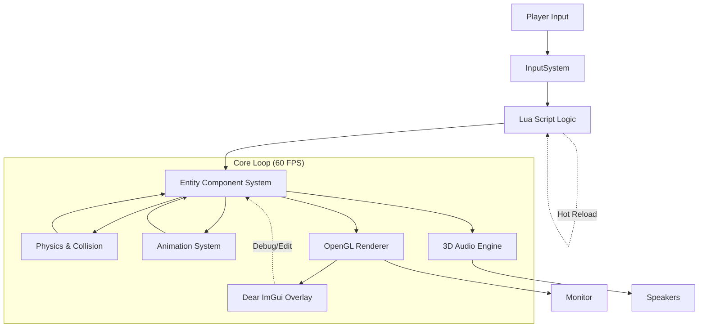

# 🏗️ Complete Game Engine Architecture Guide

This document details the internal architecture of our custom C++ Game Engine. It explains how the subsystems (Renderer, Physics, ECS, Scripting, Audio) interact to create a cohesive game loop.

---

## 1. High-Level System Diagram



---

## 2. The Core: Entity Component System (ECS)

Our engine uses a **Data-Oriented Design**. Instead of complex inheritance trees (e.g., `class Enemy : public Character`), we use **Composition**.

### A. The Three Pillars
1.  **Entity**: A unique integer ID (e.g., `ID: 101`). It has no logic or data itself.
2.  **Component**: Pure data structs.
    *   `Transform`: Position (x,y,z), Rotation, Scale.
    *   `Renderable`: Mesh ID, Texture ID, Color.
    *   `RigidBody`: Velocity, Acceleration, Mass, GravityFlag.
    *   `Collider`: Bounds (AABB/Sphere), LayerMask.
    *   `AudioSource`: SoundClip ID, Volume, Is3D.
    *   `Script`: Lua Script ID, Parameters.
3.  **System**: Logic that processes components.
    *   `PhysicsSystem`: Finds all entities with `RigidBody` + `Collider` + `Transform` → Updates positions.
    *   `RenderSystem`: Finds all entities with `Renderable` + `Transform` → Draws them.
    *   `ScriptSystem`: Finds all entities with `Script` → Runs Lua update().

### B. Memory Layout
Components are stored in **Structure of Arrays (SoA)** for cache efficiency.
```cpp
// Instead of an array of objects...
struct Entity { Transform t; RigidBody r; }; // Bad for cache

// We store arrays of components...
std::vector<Transform> transforms;    // Contiguous memory
std::vector<RigidBody> rigidBodies;   // Contiguous memory
std::vector<Collider> colliders;      // Contiguous memory
```
*Benefit:* When the Physics System runs, it only loads `RigidBody` data into the CPU cache, ignoring rendering data. This allows processing 10,000+ entities at 60 FPS.

---

## 3. The Game Loop Lifecycle

Every frame (approx. 16ms for 60Hz), the engine executes this strict sequence:

### Phase 1: Input & Events
1.  **Poll OS Events**: Check keyboard, mouse, window close.
2.  **Update Input State**: Map raw keys to actions (`MoveForward`, `Jump`).
3.  **Dispatch Events**: Send events to Lua scripts (e.g., `on_key_pressed('W')`).

### Phase 2: Scripting (Game Logic)
1.  **Iterate Scripts**: Run `update(dt)` for every active Lua script.
2.  **Modify ECS**: Scripts change components directly.
    *   *Example:* Player script sets `RigidBody.velocity.y = 5.0` (Jump).
    *   *Example:* Spawner script creates a new Entity (Enemy) and adds components.

### Phase 3: Physics Simulation
1.  **Broad Phase (Spatial Hash)**:
    *   Insert all `Collider` entities into the Spatial Hash Grid.
    *   Identify potential pairs (entities sharing a grid cell).
2.  **Narrow Phase**:
    *   Perform precise AABB vs. AABB checks on potential pairs.
    *   Generate **Contact Manifolds** (collision points, normals, depth).
3.  **Resolution**:
    *   Apply impulses to `RigidBody` velocities to separate objects.
    *   Apply friction and restitution (bounciness).
4.  **Integration**:
    *   Update `Transform.position` based on `RigidBody.velocity` and `dt`.
    *   Apply Gravity.

### Phase 4: Animation & Skinning
1.  **Update Skeletons**: Interpolate bone matrices based on current time/clip.
2.  **Skinning**: Update vertex buffers for animated meshes (or pass matrices to shader).

### Phase 5: Rendering
1.  **Culling**:
    *   **Frustum Culling**: Skip entities outside the camera view.
    *   **Occlusion Culling**: (Optional) Skip entities hidden behind walls.
2.  **Batching**: Group entities by Material/Shader to minimize GPU state changes.
3.  **Draw Calls**:
    *   Bind Shader.
    *   Bind Textures/Meshes.
    *   Set Uniforms (Model, View, Projection Matrices, Light Data).
    *   `glDrawElements`.
4.  **Post-Processing**: Apply Bloom, Tone Mapping, or Gamma Correction to the final framebuffer.

### Phase 6: Audio Update
1.  **Listener Update**: Set camera position/velocity as the audio listener.
2.  **Source Update**: Calculate 3D attenuation and panning for every `AudioSource`.
3.  **Mix**: Mix active sounds into the output buffer.

### Phase 7: UI & Debug
1.  **ImGui Render**: Draw the editor overlay (Hierarchy, Inspector, Stats) on top of the 3D scene.
2.  **Swap Buffers**: Present the final image to the screen (`glfwSwapBuffers`).

---

## 4. Key Subsystem Details

### A. Spatial Hashing (Collision Optimization)
*Problem:* Checking N objects against N objects is $O(N^2)$. With 1000 objects, that's 1,000,000 checks.
*Solution:* Divide world into a grid.
1.  **Hash Function**: `GridIndex = floor(Position / CellSize)`.
2.  **Insertion**: Put Entity ID into the list for that GridIndex.
3.  **Query**: Only check collisions between entities in the *same* or *neighboring* cells.
*Result:* Reduces complexity to approx $O(N)$.

### B. The Asset Pipeline
Assets are not hardcoded; they are loaded dynamically.
1.  **Texture**: `stb_image` loads JPG/PNG → OpenGL `glGenTextures` → GPU Upload.
2.  **Mesh/Model**: `Assimp` parses FBX/OBJ → Extract Vertices/Indices → OpenGL VBO/VAO.
3.  **Shader**: Read GLSL text → `glCompileShader` → `glLinkProgram`.
4.  **Hot Reloading**: The engine watches file timestamps. If `shader.frag` changes, it recompiles and relinks instantly without restarting.

### C. Scripting Integration (Lua)
The C++ engine exposes functions to Lua:
```lua
-- game_logic.lua
function update(dt)
    local pos = engine.get_position(player_id)
    if pos.y < 0 then
        engine.spawn_particles(pos, "dust")
        engine.play_sound("hit.wav", pos)
    end
end
```
*   **Binding**: C++ uses `lua_register` to expose `spawn_particles`, `play_sound`, etc.
*   **Safety**: Scripts run in a sandbox; a crash in Lua does not crash the C++ engine.

---

## 5. Data Flow Example: "Player Jumps"

1.  **Input**: User presses **Space**.
2.  **Input System**: Sets `Input.Jump = true`.
3.  **Script System**:
    *   Lua script detects `Input.Jump`.
    *   Checks `IsGrounded` (via Raycast query to Physics System).
    *   If grounded: Calls `engine.set_velocity(player_id, vec3(0, 10, 0))`.
    *   Calls `engine.play_sound("jump.wav")`.
4.  **Physics System** (Next Frame):
    *   Reads new velocity (0, 10, 0).
    *   Applies Gravity (-9.8).
    *   Calculates new Position.
    *   Detects collision with ceiling? Adjusts position.
5.  **Render System**:
    *   Reads new Position from `Transform` component.
    *   Updates Model Matrix.
    *   Draws player at new height.
6.  **Audio System**:
    *   Plays "jump.wav" at the player's old position (for spatial accuracy).

---

## 6. Directory Structure

```text
/GameEngine
├── /src                # C++ Source Code
│   ├── main.cpp        # Entry Point & Loop
│   ├── ecs.h           # Entity Component System
│   ├── renderer.*      # OpenGL Wrappers
│   ├── physics.*       # Collision & Dynamics
│   ├── script.*        # Lua Integration
│   ├── audio.*         # Miniaudio Wrappers
│   └── editor.*        # Dear ImGui Tools
├── /assets             # Game Content
│   ├── /shaders        # .vert, .frag files
│   ├── /textures       # .png, .jpg
│   ├── /models         # .obj, .fbx
│   ├── /sounds         # .wav, .mp3
│   └── /scripts        # .lua game logic
├── /build              # Compiled Binaries (GitIgnored)
├── /dist               # Final Release Package
├── CMakeLists.txt      # Build Configuration
└── README.md           # Documentation
```

---

## 7. Extending the Engine

To add new features, follow the **ECS Pattern**:

1.  **New Feature**: e.g., "Health System".
2.  **Create Component**:
    ```cpp
    struct Health { float current; float max; };
    ```
3.  **Create System**:
    ```cpp
    class HealthSystem {
        void update(float dt) {
            // Iterate all entities with Health + Script
            // Apply damage over time, check for death
        }
    };
    ```
4.  **Register**: Add `HealthSystem` to the main loop in `main.cpp`.
5.  **Scripting**: Expose `take_damage(amount)` to Lua.

---

## 8. Performance Considerations

*   **Draw Calls**: Minimize by batching objects with the same material.
*   **Cache Coherency**: Keep component arrays contiguous (SoA).
*   **Memory**: Use object pools for frequent spawn/destroy (particles, bullets) to avoid `malloc`/`free` fragmentation.
*   **Multithreading**: (Future) Move Physics and Culling to a worker thread, leaving Rendering on the main thread.

---

## Conclusion

This architecture provides a scalable, high-performance foundation. By decoupling data (Components) from logic (Systems), you can easily add new mechanics without rewriting existing code. The integration of Lua allows designers to iterate on gameplay instantly, while the C++ core ensures maximum speed for rendering and physics.

**You are now ready to build your game!**
